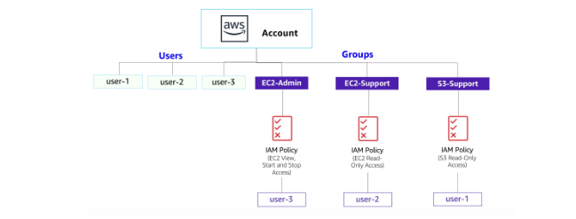
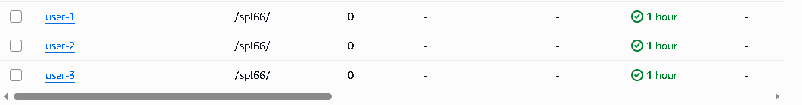
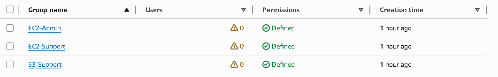
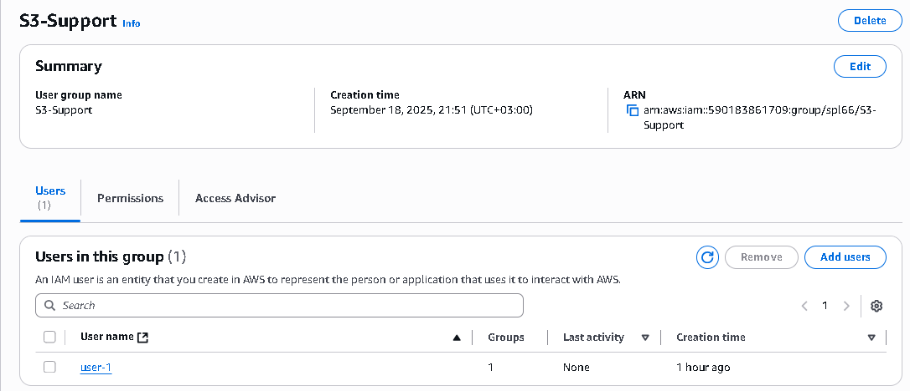
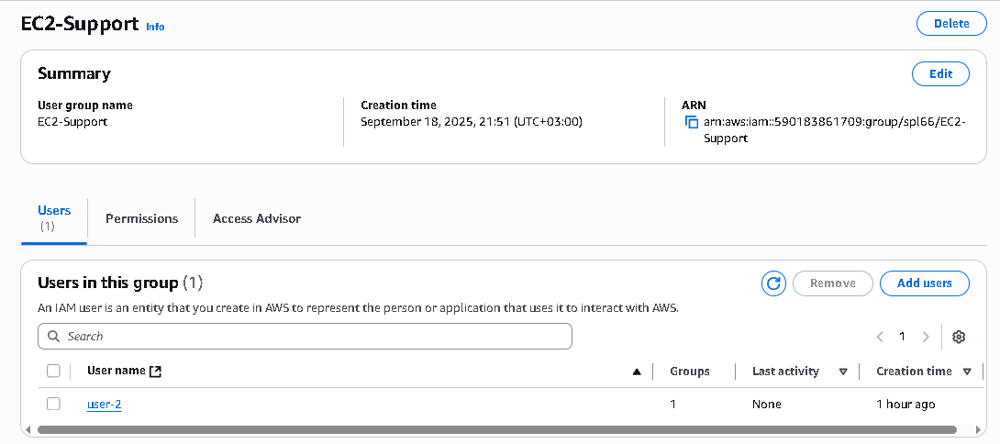
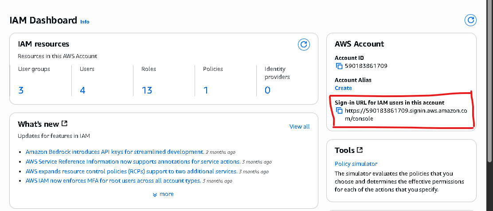
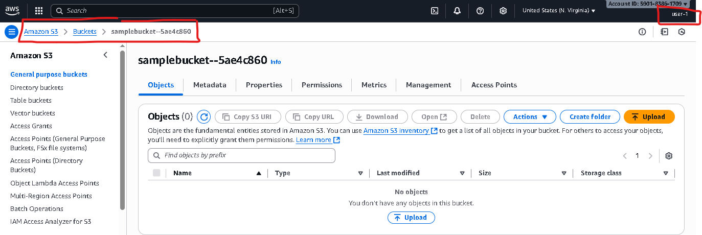
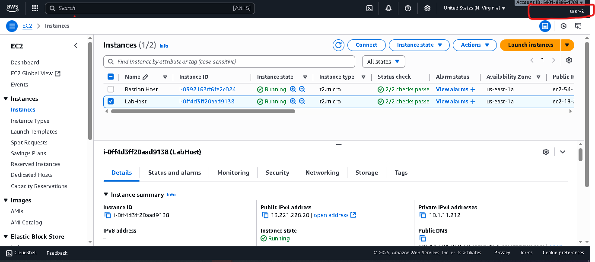

# AWS IAM Lab Project

**Date:** Sep 2025  

## 📌 Introduction
This project demonstrates the use of **AWS Identity and Access Management (IAM)** to manage users, groups, and permissions in AWS.  
The lab simulates a real-world scenario where users are assigned to groups with different levels of access to AWS services such as **Amazon EC2** and **Amazon S3**.

---

## 🎯 Objectives
- Explore pre-created IAM users and groups.
- Inspect IAM policies attached to groups.
- Add users to groups according to business requirements.
- Locate and use the IAM sign-in URL.
- Test permissions of different IAM users by signing in and accessing AWS services.
- Observe the effects of IAM policies on service access.

 📷 *Screenshot:*  

---

## 🛠️ AWS Services Used
- **IAM (Identity and Access Management)**
- **Amazon EC2**
- **Amazon S3**

---

## 📝 Lab Execution

### **Task 1: Explore Users and Groups**

1. 1. Navigate to **IAM → Users**.  
   - Pre-created users: `user-1`, `user-2`, `user-3`.

   📷 *Screenshot:*  
   
2. Navigate to **IAM → Groups**.  
   - Pre-created groups:
     - `EC2-Admin` → Inline Policy (Start/Stop EC2).
     - `EC2-Support` → Managed Policy (AmazonEC2ReadOnlyAccess).
     - `S3-Support` → Managed Policy (AmazonS3ReadOnlyAccess).

   📷 *Screenshot:*  
   

---

### **Task 2: Add Users to Groups**

- **Business Requirement Table**

| User   | Group       | Permissions                               |
|--------|-------------|-------------------------------------------|
| user-1 | S3-Support  | Read-only access to Amazon S3             |
| user-2 | EC2-Support | Read-only access to Amazon EC2            |
| user-3 | EC2-Admin   | View, Start, and Stop Amazon EC2 instances|

---

#### Add user-1 to S3-Support
1. Go to **Groups → S3-Support → Add User → Select user-1**.  
2. Confirm addition.

📷 *Screenshot:*  

---

#### Add user-2 to EC2-Support
1. Go to **Groups → EC2-Support → Add User → Select user-2**.  
2. Confirm addition.

📷 *Screenshot:*  

---

#### Add user-3 to EC2-Admin
1. Go to **Groups → EC2-Admin → Add User → Select user-3**.  
2. Confirm addition.

📷 *Screenshot:*  

---

### **Task 3: Sign-In and Test Users**

#### IAM Sign-In URL
- Copy IAM Sign-in URL from Dashboard.  
Example:  

#### IAM Sign-In URL
- Copy IAM Sign-in URL from Dashboard.  
Example:  
`https://123456789012.signin.aws.amazon.com/console`

📷 *Screenshot:*  

---

#### Test user-1- Login with:  
  - Username: `user-1`  
  - Password: `Lab-Password1`  
- Access S3 → ✅ Allowed.  
- Access EC2 → ❌ Not authorized.  

📷 *Screenshot:*  

---

#### Test user-2
- Login with:  
  - Username: `user-2`  
  - Password: `Lab-Password2`  
- Access EC2 → ✅ Read-only (cannot stop/start instances).  
- Access S3 → ❌ Not authorized.  

📷 *Screenshot:*  
  

---

#### Test user-3
- Login with:  
  - Username: `user-3`  
  - Password: `Lab-Password3`  
- Access EC2 → ✅ Full permissions (can stop/start instances).  

📷 *Screenshot:*  

---

## 🔄 How to Reproduce the Lab
1. Create users (`user-1`, `user-2`, `user-3`) with console passwords.  
2. Create groups (`S3-Support`, `EC2-Support`, `EC2-Admin`) and attach proper policies.  
3. Assign users to groups based on business requirements.  
4. Use IAM Sign-in URL to test user permissions in Incognito browser.  

---

## 📂 Project Duration
⏱️ Approx. 40 minutes.

## ✅ Conclusion
Through this lab, IAM concepts were reinforced by:
- Managing users and groups.
- Applying both managed and inline IAM policies.
- Testing the impact of permissions in real-world scenarios.

This project highlights how **IAM policies** enable fine-grained access control, ensuring security and proper user-role management in AWS environments.

---

## 📷 Screenshots
All screenshots were captured from the AWS Console during lab execution. They are included in the `images/` folder for reference.

---

## 👩‍💻 Author
*Developed and documented by [Rawan Ramadan]*

---

