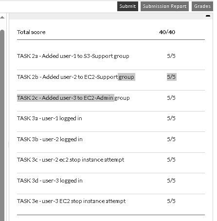

# AWS IAM Lab Project

**Date:** May 2025  

## 📌 Introduction
This project demonstrates the use of **AWS Identity and Access Management (IAM)** to manage users, groups, and permissions in AWS.  
The lab simulates a real-world scenario where users are assigned to groups with different levels of access to AWS services such as **Amazon EC2** and **Amazon S3**.

---

## 🎯 Objectives
- Explore pre-created IAM users and groups.  
- Inspect IAM policies attached to groups.  
- Assign users to groups based on job roles.  
- Test the effects of policies on service access.  
- Verify IAM sign-in and group-based permissions.  

---

## 🔑 IAM Sign-in URL
The sign-in link used by IAM users to access the AWS Console.  

Example:  
`https://123456789012.signin.aws.amazon.com/console`

---

## 👥 Task 1: Explore Users and Groups
The following IAM Users and Groups were pre-created in the environment:  

- **Users:** `user-1`, `user-2`, `user-3`  
- **Groups:** `S3-Support`, `EC2-Support`, `EC2-Admin`  

---

## 👥 Task 2: Add Users to Groups
- **user-1 → S3-Support (AmazonS3ReadOnlyAccess)**  
- **user-2 → EC2-Support (AmazonEC2ReadOnlyAccess)**  
- **user-3 → EC2-Admin (Inline Policy: View, Start, Stop EC2 Instances)**  

---

## 🧪 Task 3: Test Users

### 🔹 User-1 Test
- **S3 Access:** User-1 can view the S3 bucket.  

- **EC2 Access:** User-1 is not authorized to view EC2 resources.  

---

### 🔹 User-2 Test
- **EC2 Access:** User-2 can view EC2 instances (read-only).  

- **S3 Access:** User-2 is not authorized to view S3 buckets.  

---

### 🔹 User-3 Test
- **EC2 Access:** User-3 can view and manage EC2 instances (start/stop).  

---

## 📝 Evaluation & Score
At the end of the lab, AWS provided an evaluation score to confirm successful completion of all tasks.  

---

## ✅ Conclusion
Through this lab, the following tasks were successfully completed:  
- Explored pre-created IAM users and groups.  
- Inspected IAM policies (Managed and Inline).  
- Assigned users to appropriate groups based on roles.  
- Tested permissions for S3 and EC2 services.  
- Verified IAM sign-in with different users.  

This hands-on lab demonstrates how **IAM policies and groups** control access to AWS resources in a real-world scenario.

---
